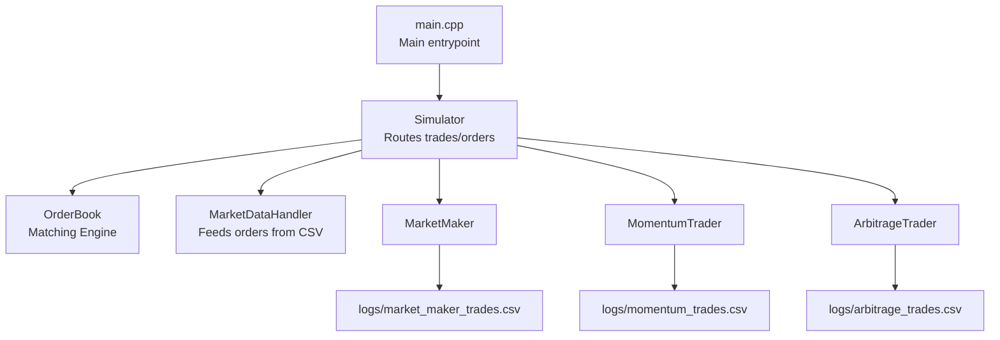
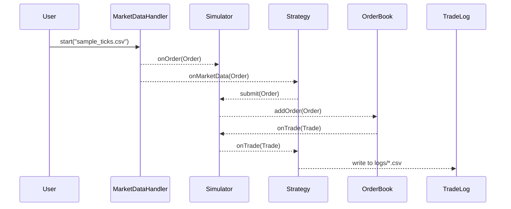

# TradeIt

A high-performance multithreaded C++ simulator for algorithmic trading.

## Features

- **Strategy Support**: Built-in support for Market Making, Arbitrage, and Momentum strategies.
- **Central Limit Order Book (CLOB)**: Fully featured matching engine with price-time priority.
- **Multithreaded Execution**: Strategies run concurrently using `std::thread`, `std::mutex`, and condition variables.
- **Risk Management**: Real-time risk checks for drawdown, max inventory, and stop conditions.
- **Logging and Metrics**: CSV logs for trades and internal metrics (PnL, inventory, spread, etc).
- **Comprehensive Test Suite**: Unit and integration tests with Catch2.
- **Modular Architecture**: Decoupled design with clean architecture.

## System Overview

The system starts with main.cpp, which loads input configuration and brings the system together. MarketDataHandler streams in orders from a CSV. These go to the Simulator, which sends them to the input strategies (Market Maker, Arbitrage or Momentum). The strategies decide whether to trade and submit orders back through the Simulator, which places them into the order book. The Order Book matches opposing buy/sell orders and creates trades, which are then sent back to strategies to update their state.

## Architecture


## Sequence: Market Data to Trade Flow



## Strategy Details

### Market Maker

- Places passive bid/ask quotes around the mid-price.
- Tracks inventory and PnL in real-time.
- Stops automatically on risk violation.

### Arbitrage

- Monitors two instruments for pricing discrepancies.
- Executes trades to capture arbitrage opportunities.

### Momentum

- Follows recent price trends and places aggressive trades.
- Can operate across different timeframes.


## Build Instructions

```bash
mkdir build && cd build
cmake ..
make
```

## How to Run

### Running the Strategy Engine

After building the project, run the engine with default configuration using:

```bash
./tradeit
```
Supported strategy options include:

- `marketmaker`
- `momentum`
- `arbitrage`

For example:

```bash
./tradeit --strategy arbitrage --file data/sample.csv --spread 0.05 --size 10 --risk -100
```

### Output and Logs

All strategy-specific logs and summaries are written to the `logs/` directory:

- `market_maker_metrics.csv`
- `market_maker_trades.csv`
- `arbitrage_trades.csv`
- `momentum_trades.csv`
- `summary.json`

These files contain structured records of trades, PnL, inventory, risk status, and other performance metrics.
