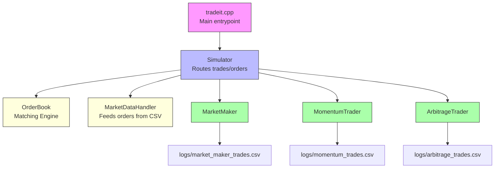
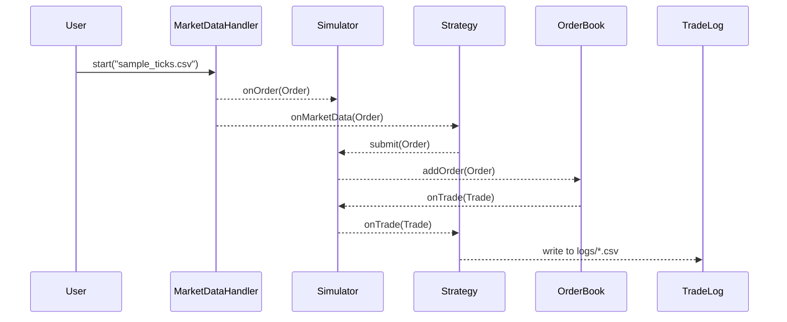

# TradeIt

A high-performance multithreaded C++ simulator for algorithmic trading.

## Features

- **Strategy Support**: Built-in support for Market Making, Arbitrage, and Momentum strategies.
- **Central Limit Order Book (CLOB)**: Fully featured matching engine with price-time priority.
- **Multithreaded Execution**: Strategies run concurrently using `std::thread`, `std::mutex`, and condition variables.
- **Risk Management**: Real-time risk checks for drawdown, max inventory, and stop conditions.
- **Logging and Metrics**: CSV logs for trades and internal metrics (PnL, inventory, spread, etc).
- **Comprehensive Test Suite**: Unit and integration tests with Catch2 framework.
- **Modular Architecture**: Decoupled design using core/engine/strategy layers.

## System Overview

The system starts with main.cpp, which loads config and kicks everything off. The MarketDataHandler streams in orders from a CSV. These go to the Simulator, which sends them to Strategies like Market Maker or Arbitrage. Strategies decide whether to trade and submit orders back through the Simulator, which places them into the OrderBook. The OrderBook matches opposing buy/sell orders and creates trades, which are then sent back to strategies to update their state.

## Architecture



### What This Shows

- `tradeit.cpp` is your main binary.
- It wires together:
  - The **Simulator**, which acts as a central hub.
  - The **OrderBook** for matching and tracking prices.
  - The **MarketDataHandler** which reads CSV order flow.
  - One of the **Strategies**: `MarketMaker`, `MomentumTrader`, or `ArbitrageTrader`.
- Strategies write logs to their respective CSV files.

## Sequence: Market Data to Trade Flow



### What It Shows

This diagram captures the full lifecycle:

1. **MarketDataHandler** reads an order from the input CSV file.
2. That order is:
   - Routed to the **Simulator** (to update state),
   - Sent to the selected **Strategy** as market data.
3. If the strategy reacts and submits an order:
   - It goes back to the **Simulator**,
   - Which forwards it to the **OrderBook**.
4. If a **trade is matched**, the OrderBook calls back:
   - The Simulator handles the trade and notifies the **Strategy**.
5. The **Strategy logs** the trade to its own CSV file under `logs/`.


## Strategy Details

### Market Maker

- Places passive bid/ask quotes around the mid-price.
- Tracks inventory and PnL in real-time.
- Stops automatically on risk violation.

### Arbitrage

- Monitors two instruments for pricing discrepancies.
- Executes trades to capture arbitrage opportunities.

### Momentum

- Follows recent price trends and places aggressive trades.
- Can operate across different timeframes.


## Build Instructions

```bash
mkdir build && cd build
cmake ..
make
```


## How to Run

### Running the Strategy Engine

After building the project, you can run the main strategy engine using:

```bash
./tradeit --strategy marketmaker --file data/eth_usd.csv
```

Supported strategy options include:

- `marketmaker`
- `momentum`
- `arbitrage`

Optional runtime parameters:
- `--file <path>`: Market data file (CSV format)
- `--spread <value>`: Used by arbitrage strategy
- `--size <int>`: Order size
- `--risk <amount>`: Max loss before strategy auto-stops

For example:

```bash
./tradeit --strategy arbitrage --file data/sample.csv --spread 0.05 --size 10 --risk -100
```

### Output and Logs

All strategy-specific logs and summaries are written to the `logs/` directory:

- `market_maker_metrics.csv`
- `market_maker_trades.csv`
- `arbitrage_trades.csv`
- `momentum_trades.csv`
- `summary.json`

These files contain structured records of trades, PnL, inventory, risk status, and other performance metrics.